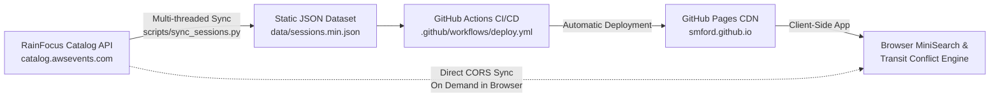

# AWS re:Invent 2026 Session Finder & Campus Bundler

[](https://github.com/smford/reinvent-2026-finder/actions/workflows/deploy.yml)

A fast, zero-latency, transit-aware session explorer and itinerary planner for **AWS re:Invent 2026** in Las Vegas.

Built with React 19, TypeScript, Tailwind CSS v4, and MiniSearch, hosted completely serverless on GitHub Pages.

🔗 **Live Website**: [https://smford.github.io/reinvent-2026-finder/](https://smford.github.io/reinvent-2026-finder/)

---

## ⚡ Problem Statement & Solution

At AWS re:Invent, sessions are scattered across distinct campus clusters on the Las Vegas Strip:
- **Caesars Campus** (Caesars Forum, Harrah's, LINQ)
- **Venetian Campus** (Venetian, Palazzo, Sands)
- **Wynn Campus** (Wynn, Encore)
- **MGM Grand Campus** (MGM Grand Conference Center)
- **Mandalay Bay Campus** (Mandalay Bay Convention Center)

Attendees frequently book sessions back-to-back across venues that require 40–60 minutes of walking or shuttle time, resulting in missed sessions and transit fatigue.

**This application solves this by:**
1. **Real-time Transit Conflict Detection**: Analyzes consecutive sessions in your itinerary and alerts you if travel time between campuses exceeds your scheduling buffer.
2. **One-Click Campus Bundling**: Generates optimized day-by-day itineraries focused on single campuses to eliminate cross-Strip transit entirely.
3. **Instant Full-Text Search**: Client-side BM25 indexing over all 2,000+ sessions with instant search as you type.
4. **RFC 5545 iCalendar (`.ics`) Export**: Export selected sessions with exact Las Vegas timezone (`America/Los_Angeles`) boundaries and location metadata.
5. **Shareable Itineraries**: Share schedule bundles via clean URL hash encoding (`#itinerary=...`) or local storage.
6. **Live or Static Data**: Operates offline/statically with pre-bundled session data, with an on-demand sync button that talks directly to the upstream RainFocus catalog API.

---

## 🛠️ Architecture & SRE Considerations



- **Zero Running Costs**: 100% static client-side bundle hosted on GitHub Pages.
- **Resilience**: Operates from pre-indexed snapshots (`data/sessions.min.json`) so the site never fails even if upstream RainFocus experiences downtime or rate-limiting.
- **Automated Freshness**: GitHub Actions workflow runs twice daily (and on demand) to re-sync any newly scheduled or canceled sessions.
- **Rendering Performance**: Implements CSS `content-visibility: auto` to sustain 60fps scrolling across 2,000+ session cards.

---

## 🚀 Getting Started

### Prerequisites
- Node.js 20+
- Python 3.10+ (for catalog sync script)

### 1. Install Dependencies
```bash
npm install
```

### 2. Run Local Development Server
```bash
npm run dev
```
Open `http://localhost:5173/reinvent-2026-finder/` in your browser.

### 3. Sync Latest Session Catalog
To fetch the latest session data from the AWS re:Invent catalog API:
```bash
python3 scripts/sync_sessions.py
```
This fetches all 2,000+ sessions in parallel, normalizes campus venues, and writes compressed datasets to `data/` and `public/data/`.

### 4. Build for Production
```bash
npm run build
```

---

## 📅 Las Vegas Campus Transit Matrix

| Origin | Destination | Estimated Travel Time |
| :--- | :--- | :---: |
| Venetian | Wynn | ~15 min (Walk) |
| Caesars Forum | Venetian | ~20 min (Walk) |
| Caesars Forum | Wynn | ~25 min (Walk) |
| Venetian / Caesars | MGM Grand | ~45 min (Shuttle / Monorail) |
| Wynn | MGM Grand | ~50 min (Shuttle / Monorail) |
| Any Strip Campus | Mandalay Bay | ~55-60 min (Shuttle) |

---

## 📄 License
MIT License.